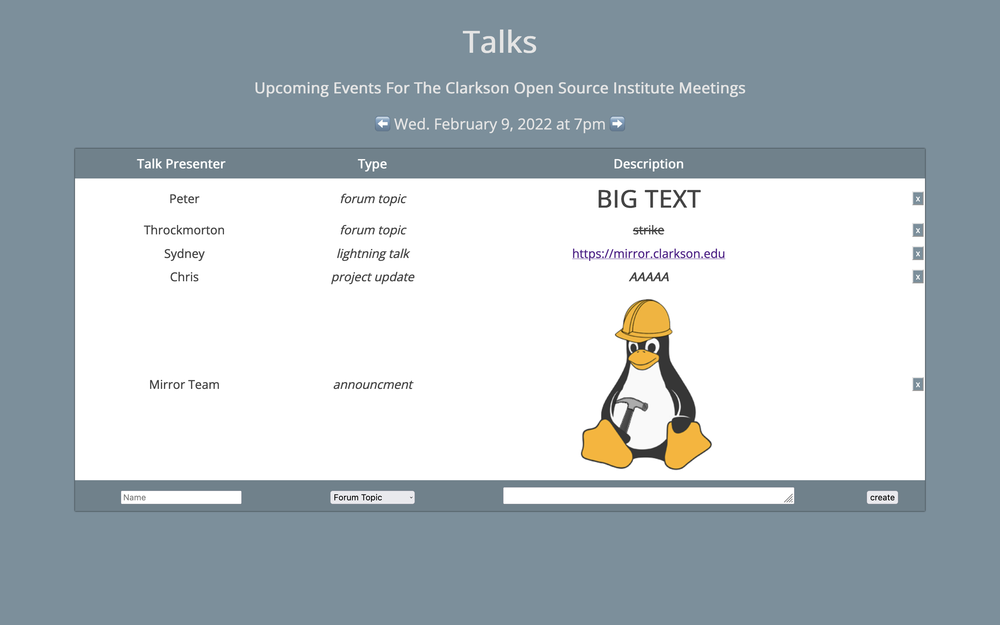

# go-talks

Another rewrite of talks, this time in go. 

go-talks (Or more commonly known as just Talks) is an app to manage talks at COSI meetings. It allows people to submit talks that they are planning on giving at upcoming meetings.



## Development

**Auto reload:**
```
gin -x talks.db -b main -a 3001 -i
```

## Endpoints

| Request | Endpoint           | Desc                                             |
| :------ | :----------------- | :----------------------------------------------- |
| GET     | /                  | The talks homepage                               |
| GET     | /{week}            | The talks for the given week                     |
| GET     | /{week}/talks      | JSON of the talks for a week                     |
| GET     | /health            | Indicates how many active connections there are  |
| GET     | /ws                | Websocket endpoint                               |

**Create a new talk**
```json
{
    "type": 0,
    "name": "mirror team",
    "talktype": 0, // forum topic
    "description": "new drives for mirror",
    "week": 20220126, // YYYYMMDD optional, what day to add the talk to. empty for current week otherwise must be in the future and a Wednesday
}
```

**Hide a talk**
```json
{
    "type": 1,
    "id": 10, // talk id
}
```

**Delete a talk**
```json
{
    "type": 2,
    "id": 10, // talk id
}
```

TODO: MOVE TALKS